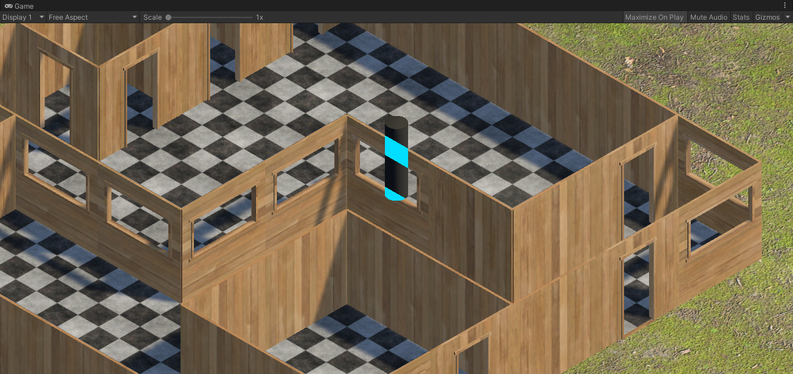
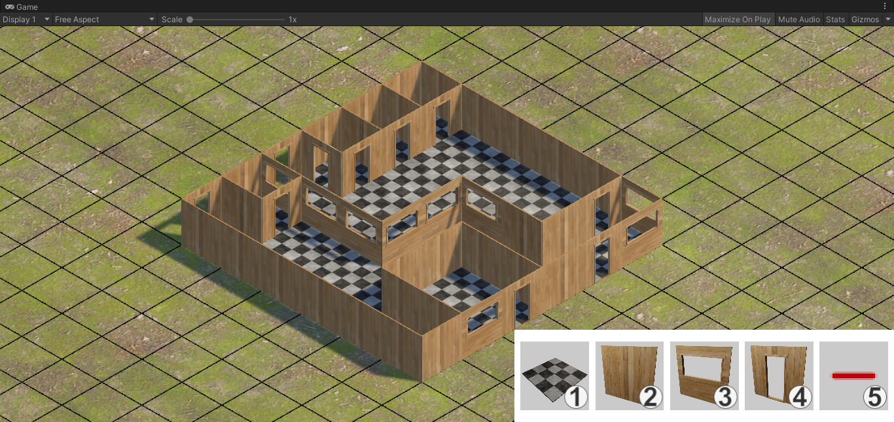
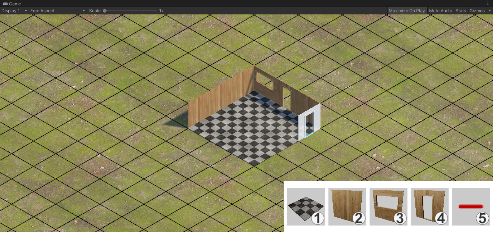

# GridSystem (3D Modular Building System in Unity)

🏗️ A **3D modular building system** developed in Unity, enabling players to construct floors, walls, windows, and doors on a grid in an isometric 3D environment.

## 🧱 About the Project

This system provides the foundation for a **grid-based 3D building game**.

Players can interactively place and remove modular elements like walls and floors using a UI toolbar, while snapping to a grid aligned with a 3D isometric view.

## 🎮 Key Features

- 🧩 3D modular building (floor, wall, window, door)
- 🎯 Grid snapping and alignment
- 🖱️ Mouse-based interaction for placing and removing objects
- 🧭 Isometric camera angle with 3D perspective
- 🧰 UI tool selection (tileset switching)
- 💾 Save game status using JSON

## 📸 Screenshots

- 
- 
- 

## 🚀 Getting Started

### Requirements

- **Unity Editor** – Recommended: `Unity 2019.4.10f1` or newer

### How to Run

1. Clone the repository:
   ```bash
   git clone https://github.com/Pixel0Void/GridSystem.git
   ```
2. Open the project in Unity Hub.
3. Launch the `Game` scene
4. Use `Tab` key for edit
5. Use the on-screen UI or number keys `1–5` to select different build parts.
6. Click on the scene to place or remove objects.

## 📌 Disclaimer

This is a prototype project developed for learning purposes and experimentation with 3D grid building mechanics in Unity.

---

🔧 Create, customize, and experiment — one tile at a time.
